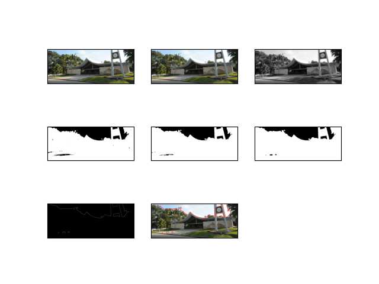
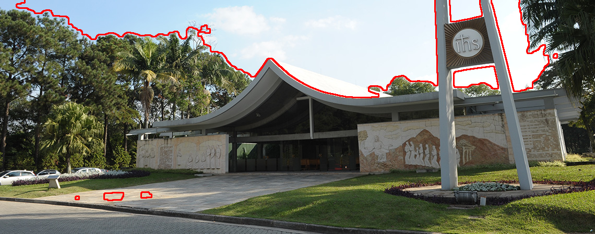

# Canny Edges - FEI
Application of canny edges algorithm to detect a Cathedral on FEI University Center

O código utilizado está disponível em: **main.py**.

## Técnicas utilizadas:

## Resultado final:

